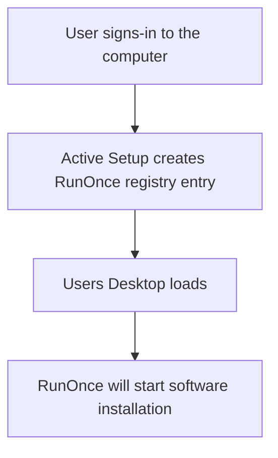

# WiX toolset 4 CLI
### Downloads and documentation
Download links:
* [Ryver](https://ryver.com/downloads/)

Actions performed by MSI file:
* Software installation file placed in C:\ProgramData\\_packages\GUID
* Active Setup registry key created

Software installation flow using Active Setup and RunOnce:



Silent switches:
```powershell
/silent
```

Generate package guid:
```powershell
[guid]::NewGuid().guid
```

WiX build MSI package command:
```powershell
wix build .\Ryver.wxs
```

### WiX Toolset 4 CLI <br />
[Windows Tools: Download and install .NET 7 SDK and WiXtoolset 4 CLI tool](https://youtu.be/ukrIlmadTjw) <br />
[Group Policy: Packaging EXE into MSI for Group Policy software deployment using WiX toolset CLI](https://youtu.be/pZ42XS2Ucsg) <br />

### Windows registry <br />
[Windows Registry: Run and RunOnce](https://youtu.be/zgFzCq5uEPw) <br />
[Windows Registry: Active Setup](https://youtu.be/HrVJ7wdvfmo) <br />

### PSEXEC
[Windows tools: Using PSEXEC for software deployment testing](https://youtu.be/9ywdTna_TLc) <br />